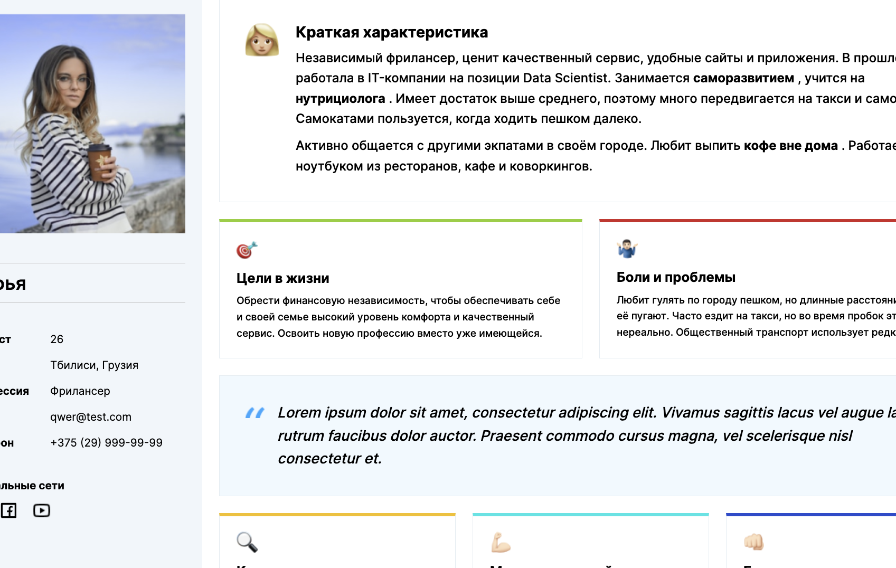
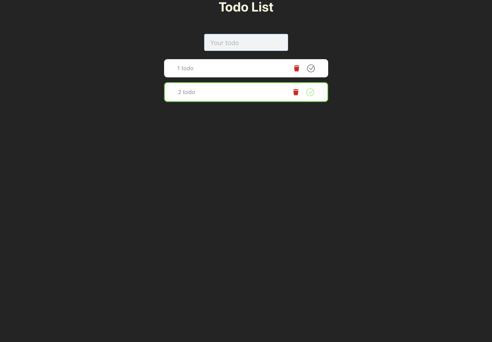
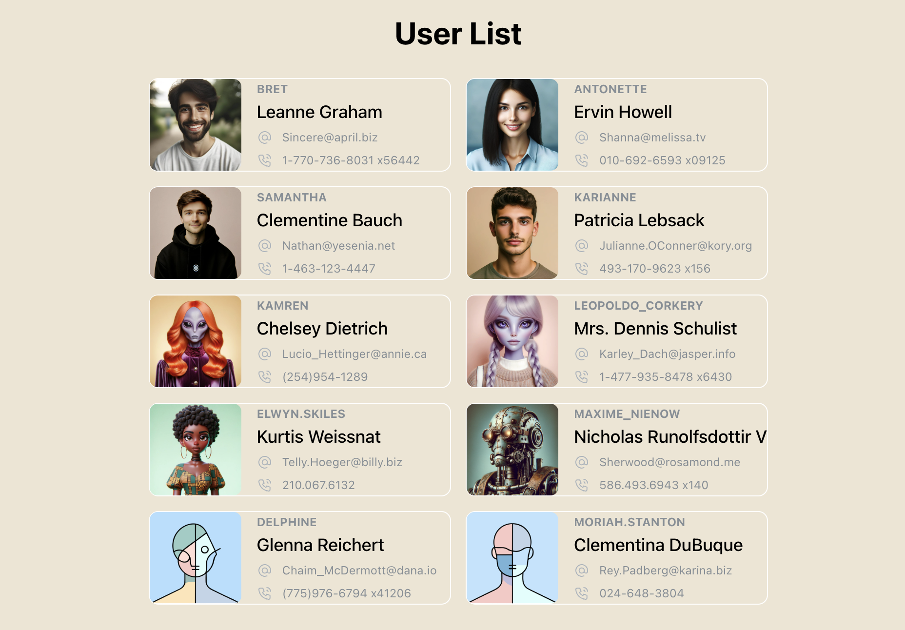

1. Profile

Deploy: https://lickoneyou.github.io/Makeunion_Tasks/Profile/

GitHub: https://github.com/lickoneyou/Makeunion_Tasks/tree/profile

Figma maket: https://www.figma.com/design/E34tIzHbGkd3hIuWVPBtFW/%D0%9F%D0%BE%D1%80%D1%82%D1%80%D0%B5%D1%82-%D0%BF%D0%BE%D0%BB%D1%8C%D0%B7%D0%BE%D0%B2%D0%B0%D1%82%D0%B5%D0%BB%D1%8F-(Community)?node-id=1-162&m=dev

2. Pull Request https://github.com/lickoneyou/Makeunion_Tasks/pull/1

3. Todo List

Deploy: https://lickoneyou.github.io/Makeunion_Tasks/TodoList/

GitHub: https://github.com/lickoneyou/Makeunion_Tasks/tree/todoList

4.Users List

Deploy: https://user-list-mauve-gamma.vercel.app/

GitHub: https://github.com/lickoneyou/Makeunion_Tasks/tree/usersList

